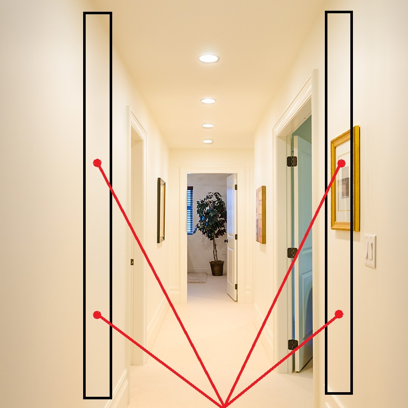

# Projet : Robot cartographe

Ce projet a pour objectif de créer un robot permettant de modéliser la zone qu'il explore.
Celui-ci est commandé à distance et équipé d'une caméra embarquée et des capteurs de distance.

Le flux vidéo et les données de télémétrie permettent, grâce à un logiciel utilisant la bibliothéque VTK, de modéliser la zone en 3 dimensions.

## Principe de modélisation : 

Les images prises par la caméra sont analysées afin de detecter les contours de chaques éléments.

Deux capteurs télémetriques sont placés vers l'avant droit et gauche du robot (2 capteurs au total), calibrés avec la caméra. 
Ceux-ci permettent de connaitre la distance à gauche et à droite de l'image selon un angle determiné par rapport à la caméra (voir schéma).

Il y a 2 données de télémetrie par image, ainsi que la position du robot.
La position du robot est déterminée en fonction du temps du mode "avancer" et des différents angles pris par le robot.

*Avec 2 capteurs seulement, le nombre d'éléments ayant une distance dans l'image s'élève donc à deux. C'est assez peu.

L'objectif ici est de voir si ce système donne des résultats satisfaisants, ou non, pour le mapping 3D.

Dans le cas contraire, je rajouterai soit plus de capteurs, soit deux servomoteurs afin de "balayer" les surfaces avec les capteurs télémetriques.*

La technique de mapping est la suivante (pour chaque image et un seul coté) :
* Réalisation d'une détéction de contours (+ détection de region) sur l'image.
* Récupération des deux distances et association avec l'objet en question.
* Les regions "non associées à une distance" sont associées soit à une region précedement detectée (si c'est le même type de zone), ou alors ne seront pas interprétées.
* Modélisation (création de points) sur le modèle 3D en prenant en compte les contours formant les zones, les distances de celles-ci, et la position du robot.

Toutes ces données (images + distance + coordonnées du robot) permettent de réaliser un mapping en 3 dimensions de l'environnement dans lequel évolue le robot.

La gestion des redondances de plan d'image est primordiale pour controler la justesse de la modélisation.

## Composition du robot

Le robot est une structure métallique comprenant deux motoreducteurs. Ceux-ci sont alimentés par une batterie 18650, a travers un L298N.

Le système est principalement composé d'une Raspberry pi zero. Celle-ci transmettra les données vidéos et télémétriques par liaison WIFI à un ordinateur, ainsi que de controler les moteurs par PWM.

Deux capteurs télémetriques vl53l0x et une picaméra sont aussi présents sur les GPIO et le connecteur MIPI de la Raspberry pi zero.

## Mise à jour 
* 12/11/2023 : Création du projet.
* 19/11/2023 : Actualisation du principe de modélisation et de la composition du robot.
* 26/11/2023 : Test des capteurs vl53l0x (en I2C) et TfMini (UART).
* 17/12/2023 : Test de transmission et reception vidéo
* 26/12/2023-01/01/2024 : Tests moteurs + envoi données telemetriques + combinaison d'envoi des données capteurs/video 
* 05/01/2024-06/01/2024 : Création du modèle CAO sous FreeCad du support des composants du systèmes sur le chassis du robot.
* 07/01/2024-08/01/2024 : Création du modèle PCB sous Kicad afin de gérer la partie alimentation et le bus I2C.

