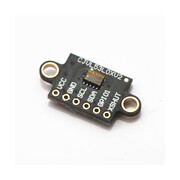
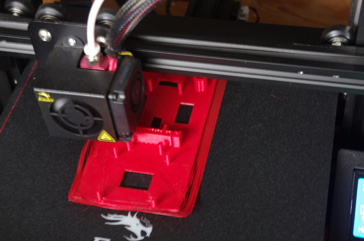
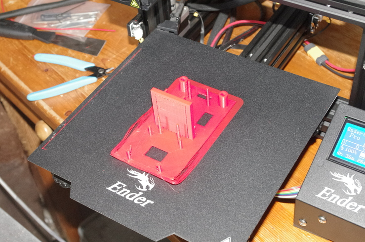
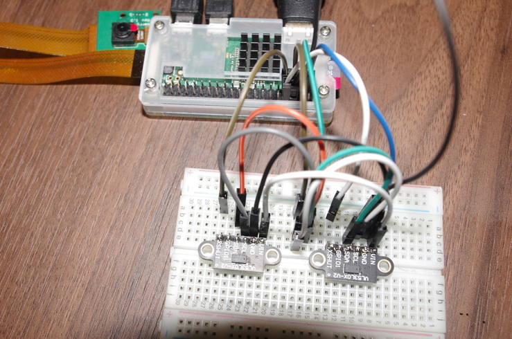

# Projet : Robot cartographe
## Par Alexandre Bouquet

## Introduction

L’objectif du projet est de créer un robot récupérant des informations télémétriques sur son environnement, afin d’en réaliser un mappage 2D de ce dernier.
Grâce à une connexion WIFI, le robot doit pouvoir envoyer un flux vidéo à l’utilisateur, recevoir les commandes de navigation de celui-ci, et transmettre des données télémétriques (+ coordonnées x,y du robot).
A coté de cela, un logiciel devra réaliser le plan 2D de l’environnement du robot, grâce aux données reçues.

## Partie I : Choix des composants

Je suis partie d’un support comportant deux motoréducteurs, deux roues et une bille centrale.

J’ai choisi une Raspberry pi zéro pour le contrôle central, pour plusieurs raisons :
* Développement rapide avec python
* Déjà équipée d’une caméra, du wifi et de GPIO
* De petite taille, faible consommation

Deux capteurs télémétriques VL53L0X sont utilisés. La distance mesurée est de l’ordre du mètre.
En effet, ne sachant pas exactement la structure finale du projet, je suis finalement resté sur ce modèle.

Afin de contrôler les deux moteurs, j’utilise le L298N. Doté d’un pont en H et d’un régulateur 5v, il permet de piloter les moteurs d’avant en arrière pour chacun d’eux, grâce à des signaux PWM et de contrôles.

Deux batteries 18650 (pour un total de 8,4v) permettent d’alimenter la Raspberry pi et le L298N.

## Partie II : Alimentation

Comme dit précédemment, le L298N possède une sortie 5V. Je pensais l’utiliser pour alimenter la Pi lorsque je me suis rendu compte qu’elle pouvait délivrer moins de 500mA. 
Or, le démarrage de la Raspberry pi est consommateur. 
De plus, l’alimentation est bruitée lorsque les moteurs sont utilisés.

J’ai donc décidé de créer une alimentation stabilisée de 5V, alimentée par les batteries.
Pour cela, j’ai utilisé le régulateur 5V L7805CV, combiné avec deux condensateurs afin de filtrer la sortie.

L’ensemble est soudé sur une carte à pastille :

## Partie III : Contrôle des Moteurs

Le L298N permet le contrôle de 2 moteurs grâce à :
* 2 signaux PWM pour l’alimentation
* 4 signaux de contrôles pour le sens de rotation

Ce module est directement alimenté par les batteries. La Raspberry pi fournie les 6 signaux nécessaires pour l’utilisation du module grâce à ses GPIO.

La tension moyenne nécessaire pour la rotation d’une roue est de 35 % de 8,4V donc environ 3V.

Les signaux PWM sont de type matériel sur la Pi, ce qui évite de consommer du temps processeur pour les générer.

## Partie IV : Contrôle des capteurs

Les capteurs télémétriques utilisés sont les VL53L0X.
Ils communiquent à travers un bus I2C (SDA, SCL). Par défaut, les deux ont l’adresse 0x29 une fois connectés au bus.
Pour la changer (et pouvoir identifier les deux), j’utilise la broche XSHUT afin d’activer les capteurs un par un (et effectuer le changement d’adresse).

Pour relier les deux capteurs au bus I2C de la Raspberry Pi, j’ai soudé un bus sur une plaque à pastille, afin de mettre en commun l’alimentation, le SDA et le SCL :

La bibliothèque python adafruit_vl53l0x permet un contrôle aisé des capteurs
(changement d’adresse + récupération distance).

Lorsque le capteur ne peut calculer la distance car celle-ci est trop grande (supérieur à 1.5 mètres), celui-ci renvoi 817 (plus de 8 mètres). C’est donc pris en compte lors de la réalisation du plan 2D.

## Partie V : Réalisation 3D

Afin de maintenir les composants en place sur le support, j’ai dessiné sous FreeCAD un deuxième support, et l’ai imprimé avec mon imprimante 3D :

## Partie VI : Fonctionnement du robot

Trois programmes python ont été réalisés : un pour la Raspberry pi (le robot), un pour l’ordinateur de l’utilisateur, un pour réaliser le mappage 2D avec le fichier de donnée.

Tout d’abord, la Raspberry pi se connecte à l’ordinateur de l’utilisateur.

Trois sockets sont utilisées :
* une pour l’envoi de la vidéo (type filelike)
* une pour l’envoie des données télémétriques et des coordonnées (x,y)
* une pour la réception des commandes de l’utilisateur

La vidéo et les données télémétriques sont stockées dans deux fichiers différents.

Si le robot effectue une rotation ou s’il avance, les coordonnées du robot (x et y) sont modifiées.

Par manque de temps, j’ai programmé des rotations de 90 degrés
uniquement. Cela simplifie les calculs de coordonnées du robot, et évite de
rajouter des erreurs de positionnement.

Lorsque le robot est en mode « avancer », les données des capteurs sont
transmises et les coordonnées s’adaptent toutes les 0,2 secondes.

Sur l’ordinateur de l’utilisateur, un terminal permet d’envoyer les
commandes, et récupérer la vidéo transmise par le robot, affichée grâce au
lecteur MPV.

La vidéo à un retard de plusieurs secondes par rapport à la réalité.
Le logiciel de mappage 2D dessine les liens entre tous les points renvoyés
par les capteurs. Il utilise la bibliothèque Matplotlib.

Schéma électrique final du projet :

## Partie VII : Tests

### Calibrage des capteurs VL53L0X

J’ai constaté que les capteurs ne renvoyaient pas la même valeur de distance pour une
même distance.

Par conséquent, j’ai réalisé une calibration des capteurs grâce à un plan fixe.

### Vérification des signaux PWM pour les moteurs

Les signaux PWM sont générés par la Raspberry pi. Ils vont de 0 à 3.3V lorsque le
dutycycle est à 100 % :

![Figure 14: Test PWM dutycycle à 10%(images/15.jpg)

### Test complet du robot

J’ai réalisé le test de la totalité des fonctionnalités du robot sur une table plate.

Chacune a été testée :
* Connexion au réseau WIFI local
* Transmission/Réception des commandes de l’utilisateur
* Transmission/Réception du flux vidéo, données télémétrique, coordonnées du robot (x,y)
* Enregistrement dans un fichier la vidéo et dans un autre les données.
* Translation avant, rotation gauche/droite, arrêt

### Test sur parcours

J’ai vérifié la performance du robot sur un parcours intérieur, avec un sol avec des
rainures (sol non plat → voir la vidéo du projet). Le robot a réalisé les objectifs
attendus (transmission/réception vidéo, données, commandes).

Mais plusieurs problèmes ont été constatés :
* les roues du robot vibrent et ne permettent pas au robot de rester bien droit (perte de précision de positionnement du robot).
* L’engin en lui-même vibre beaucoup (désagréable sur la vidéo)
* Un sol qui n’est pas plat peut entraver le robot
* les rotations du robot sont très approximatives

Pour que le plan final soit parfait, il est nécessaire d’avoir les coordonnées de positon
du robot exacte et une fréquence d’envoi des données télémétriques assez grande.

### Modélisation 2D de l’environnement

Avec le programme réalisé nommé « mappage_2D », les coordonnées envoyées par
le robot ont pu être traitées afin de définir le plan de la zone d’évolution du robot :

## Partie VIII : Points d’améliorations

La structure du robot doit être améliorée afin d’éviter tout basculement et vibration
du robot.
De plus, la façon de calculer la position du robot (en fonction de la rotation et du temps de translation) est à changer par une technique plus précise.
Enfin, je n’ai pas eu le temps de réaliser le traitement des images reçues pour augmenter la précision de la modélisation de l’environnement.

## Conclusion
Ce projet a demandé des compétences dans différents domaine, comme la programmation python, le réseau, Linux, l’électronique et la CAO.

Le prototype du robot cartographe réalise les objectifs attendus :
* Réception des commandes
* Transmission vidéo, données télémétrique
* Mappage 2D proche du plan réel du terrain

Mais il comporte un certains nombres de points à améliorer, de la structure non fixe, à la précision du mappage 2D, en passant par la maîtrise de l’angle de rotation de l’engin.

### A savoir

Le programme à placer sur la Raspberry pi est prog_pi.py
Le programme à placer sur l'ordinateur de l'utilisateur est prog_utilisateur.py
Le programme pour mapper un plan 2D gràce à un fichier de données est mappage_2D.py
